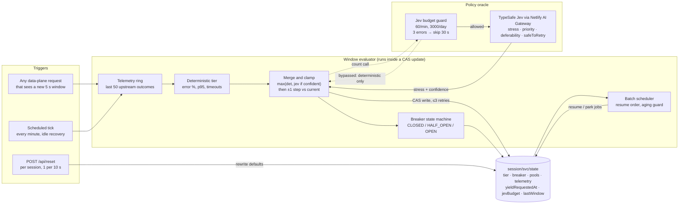
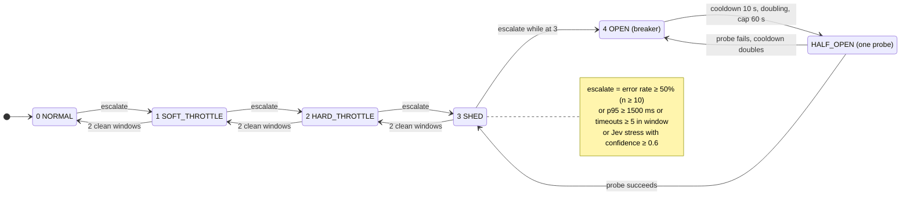
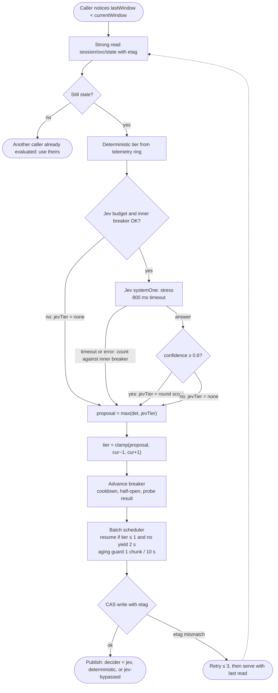
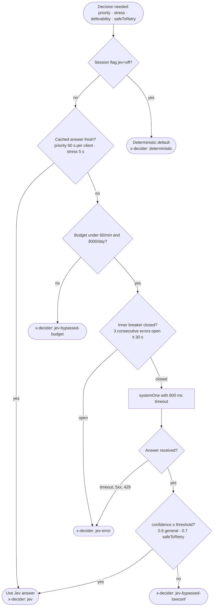
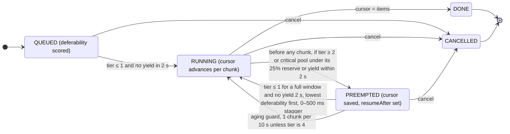

# Control plane

The control plane decides *policy*: what tier the system is in, whether the breaker is open, which batch jobs may run,
and how much the Jev decision model is allowed to influence any of that. It never serves visitor traffic directly.
Every control-plane output is a small piece of state in one Blobs record per session namespace (`<session>/svc/state`)
that the data plane reads.

Design rule shared by all five diagrams: **Jev is advisory, code is authoritative.** Jev may make the system more
cautious, never less safe. Its influence is gated by confidence, bounded by a one-step clamp per window, and budgeted.

## 1. Components and control signals

## 2. Tier ladder and breaker state machine

Tiers move at most one step per 5 s window in either direction. The breaker owns tier 4.

## 3. Window evaluation sequence

## 4. Jev decision cascade

Every Jev answer, for all four questions, passes through the same cascade. The `x-decider` header reports which exit was taken.

Deterministic defaults when Jev is bypassed: priority is `standard` (never `critical`), stress is the deterministic tier
only, deferability is level 2, and safeToRetry is false, which disables hedging.

## 5. Batch job lifecycle

Guarantees the control plane enforces:

- Preemption latency is at most one chunk, about 200 ms of upstream time.
- A preempted job never loses work, never starves thanks to the aging guard, and always finishes once pressure clears.
- Tier changes are visible one step at a time, with no cliff edges.
- Jev outages, budget exhaustion, and low confidence all degrade to the deterministic policy, with a header saying so.
