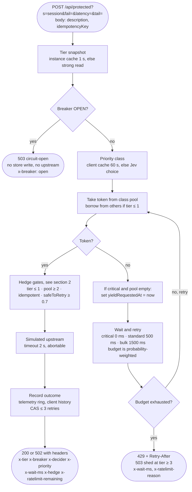
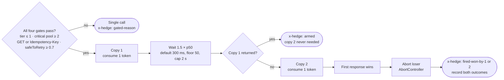
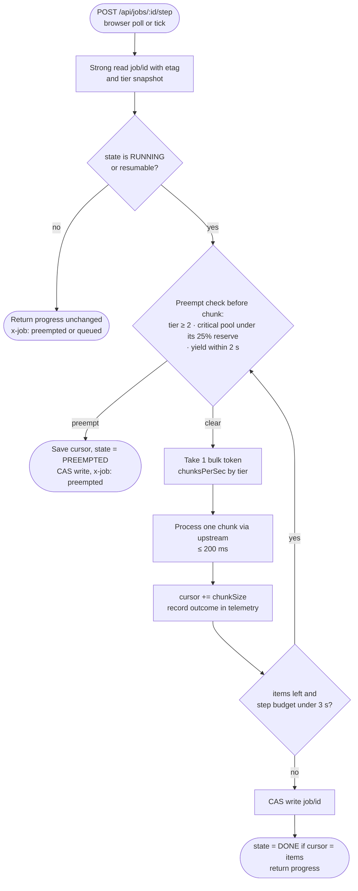
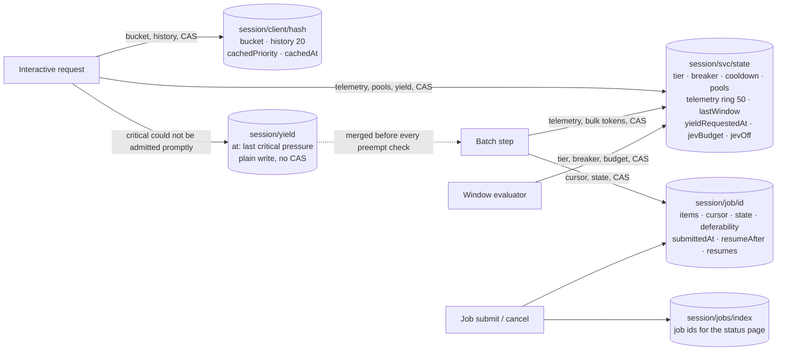

# Data plane

The data plane is every path that carries visitor traffic: interactive requests through the admission gates and an
optional hedged upstream call, batch job steps that process chunks until preempted, and status reads. It reads
control-plane state and writes only telemetry, client buckets, and job cursors. It never calls Jev on the health path.
The only inline Jev use is classification of a request or job description, and that answer is cached.

## 1. Interactive request hot path

## 2. Hedged upstream call, critical class only

Delayed 1:2 hedge. The second copy is sent only if the first has not returned within 1.5× the rolling p50 upstream latency (300 ms until there are five samples), so ordinary requests never hedge and tail requests do.
The first response wins, the loser is aborted, and the simulated upstream honours the abort.

Critical-class degradation order under pressure: the hedge is lost first through the pool gate, then the wait budget,
then admission, then the breaker fails fast. Hedging can never fire at HARD_THROTTLE or above, so it cannot amplify an
upstream slowdown.

## 3. Batch job step path

The browser drives the loop by polling the step endpoint. The scheduled tick also steps parked jobs so they finish
without a tab. Each step processes chunks until a 3 s budget is spent or a preemption condition appears.

## 4. Storage layout per session namespace

All keys are prefixed by the visitor's session id, so reviewers never see each other's stress. Writes use
compare-and-set on the Blobs etag with at most three retries.

The yield flag has its own key on purpose: under a burst the main state key is contended, and a critical request that loses the
admission race is exactly the signal batch work must not miss. A plain last-writer-wins write cannot be starved.

## 5. Response header contract

Every data-plane response carries these, so the behaviour is inspectable from curl alone.

| Header                  | Values                                                                                   |
|-------------------------|------------------------------------------------------------------------------------------|
| `x-tier`                | `0` … `4` with name, for example `2 HARD_THROTTLE`                                       |
| `x-breaker`             | `closed` · `half-open` · `open`                                                          |
| `x-decider`             | `jev` · `deterministic` · `jev-bypassed-budget` · `jev-bypassed-lowconf` · `jev-error`  |
| `x-priority`            | `critical` · `standard` · `bulk`, with probability, for example `critical p=0.91`        |
| `x-wait-ms`             | milliseconds spent waiting for a token                                                   |
| `x-hedge`               | `off` · `gated-<reason>` · `armed` · `fired-won-by-1` · `fired-won-by-2`                 |
| `x-ratelimit-remaining` | tokens left in the class pool                                                            |
| `x-ratelimit-reason`    | `pool-empty` · `shed` · `contention`                                                     |
| `retry-after`           | seconds, on 429 and 503                                                                  |
| `x-store`               | `ok` · `degraded` when Blobs is unreachable and the in-memory fallback is in use         |
| `x-job`                 | on job endpoints: `running` · `preempted` · `queued` · `done`                            |
